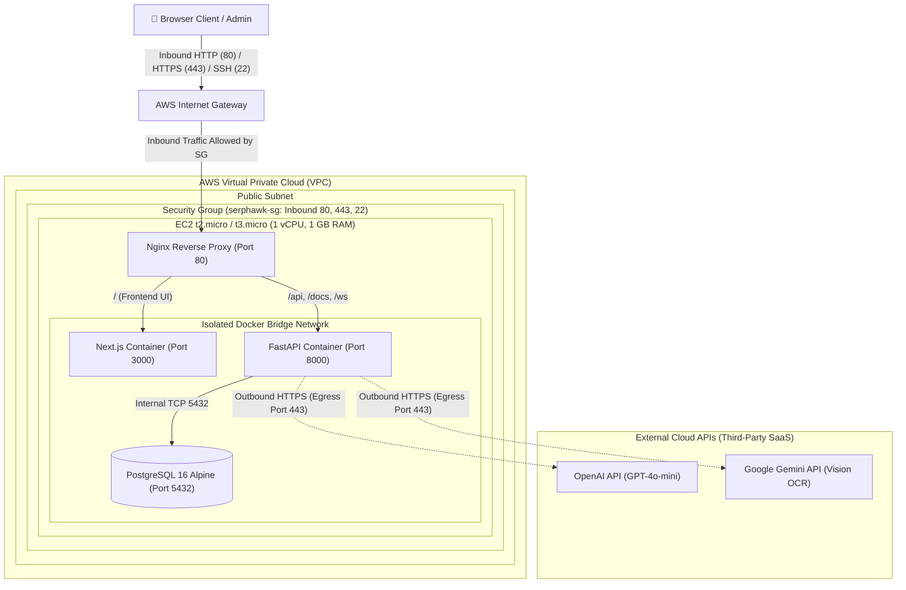
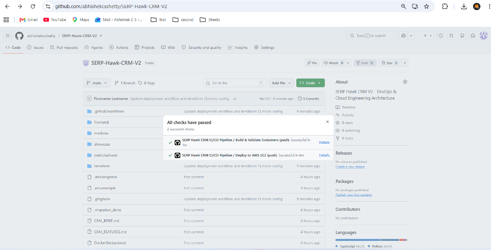
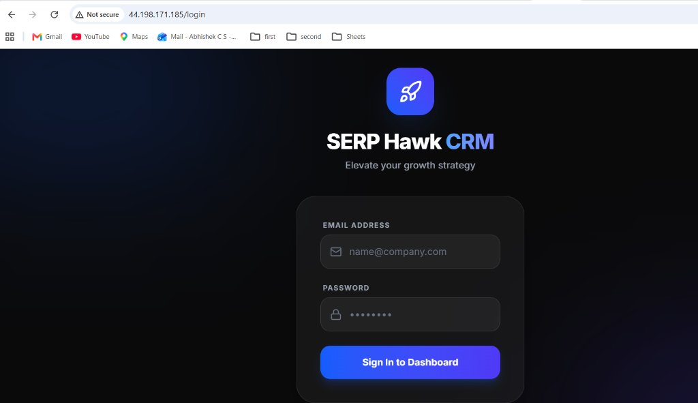
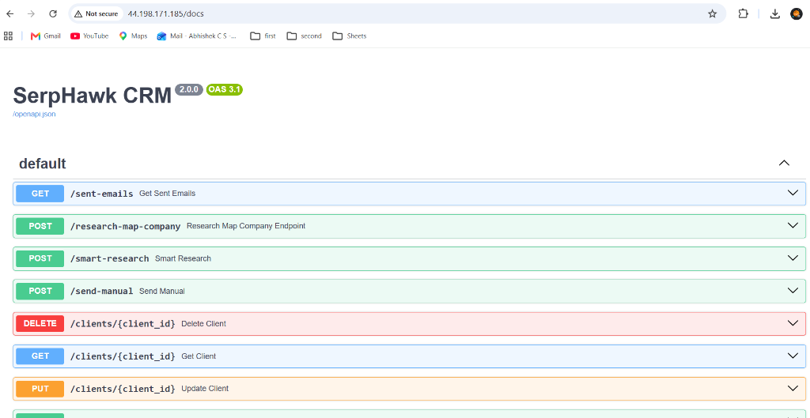
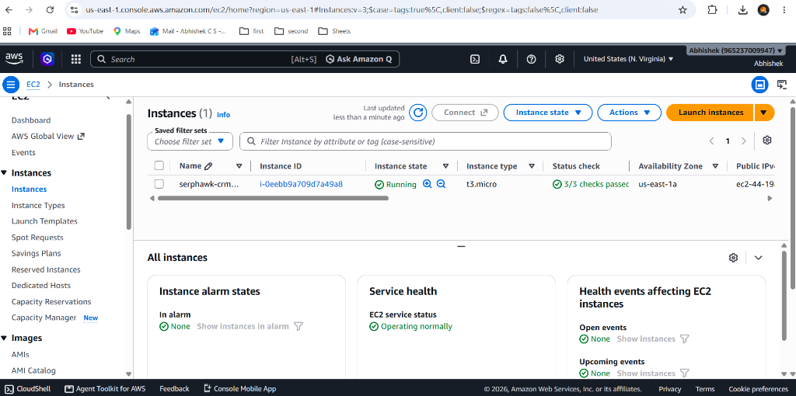
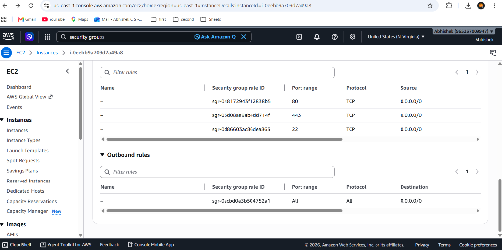
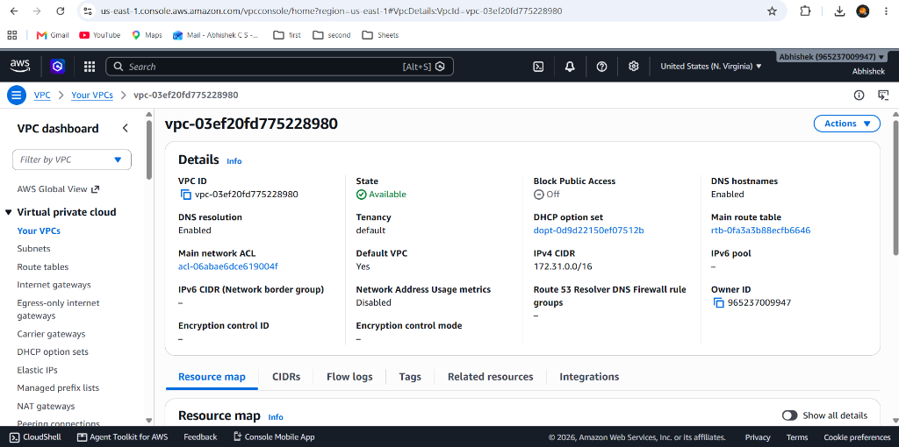
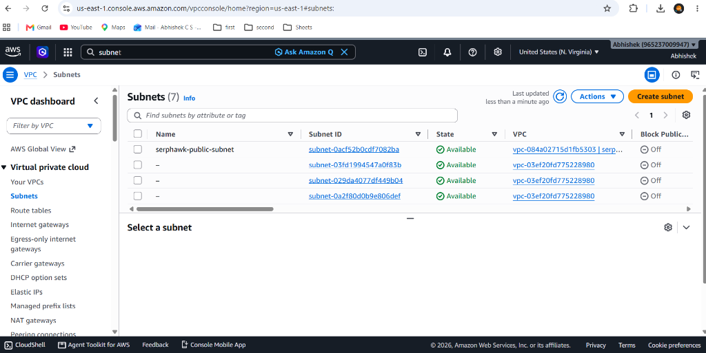
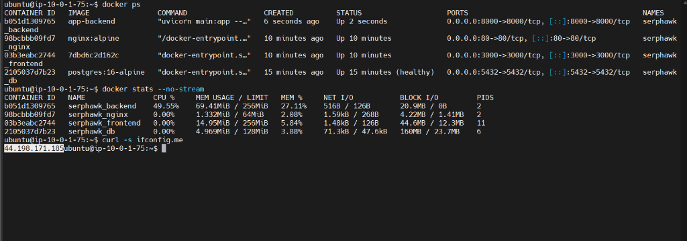

# SERP Hawk CRM V2 - DevOps & Cloud Engineering Architecture

AI-Powered CRM for SEO Agencies | Next.js 16 + FastAPI + PostgreSQL + Docker + Terraform + GitHub Actions + AWS Free Tier

---

## 📋 Table of Contents
1. [Overview & Tech Stack](#-overview--tech-stack)
2. [DevOps Architecture & Service Rationale](#-devops-architecture--service-rationale)
3. [AWS Free Tier Architecture Diagram](#-aws-free-tier-architecture-diagram)
4. [Enterprise Evolution (IaaS vs. PaaS)](#-enterprise-evolution-iaas-vs-paas)
5. [Local Docker Deployment (Low-Resource Mode)](#-local-docker-deployment-low-resource-mode)
6. [Automated Deployment (Terraform & GitHub Actions CI/CD)](#-automated-deployment-terraform--github-actions-cicd)
   - [Provisioning Infrastructure with Terraform](#provisioning-infrastructure-with-terraform)
   - [Automated CI/CD Pipeline with GitHub Actions](#automated-cicd-pipeline-with-github-actions)
   - [How GitHub Actions Automates Server Commands](#how-github-actions-automates--maintains-server-commands)
7. [Manual AWS Resource Creation & Deployment Walkthrough](#-manual-aws-resource-creation--deployment-walkthrough)
   - [Part A: Manual AWS Console Infrastructure Creation (VPC, IGW, Subnet, RT, SG, EC2)](#part-a-manual-aws-console-infrastructure-creation-vpc-igw-subnet-rt-sg-ec2)
   - [Part B: Manual Server Setup & Application Deployment](#part-b-manual-server-setup--application-deployment)
8. [Live Deployment Showcase & Verification](#-live-deployment-showcase--verification)
9. [Candidate Submission Checklist](#-candidate-submission-checklist)

---

## 📌 Overview & Tech Stack

SERP Hawk CRM V2 is an enterprise-grade relationship management system for digital marketing and SEO agencies.

- **Frontend**: Next.js 16 (React 19, TypeScript, Tailwind CSS 4)
- **Backend**: FastAPI (Python 3.13, SQLModel ORM, Uvicorn, WebSockets)
- **Database**: PostgreSQL 16 (Alpine in Docker / Neon Serverless)
- **Reverse Proxy**: Nginx (Unified entry on Port 80, Gzip compression, WebSocket upgrade)
- **Containerization**: Multi-stage standalone Docker builds (~160MB actual RAM footprint)
- **IaC**: Terraform (VPC, Security Groups, EC2 auto-provisioning)
- **CI/CD**: GitHub Actions (Build validation & automated EC2 SSH deployment)
- **Cloud Infrastructure**: AWS Free Tier (EC2 `t2.micro` / `t3.micro`)

---

## 🧠 DevOps Architecture & Service Rationale

When deploying on AWS within strict **Free Tier / Zero-Cost** limits, architectural decision-making requires balancing cost, operational overhead, and resource efficiency:

| AWS Service | Selected For | Rationale & Free Tier Safety |
| :--- | :--- | :--- |
| **AWS EC2 (`t2.micro`/`t3.micro`)** | Compute & Container Host | **750 hours/month free** (12-month tier). Running our multi-stage optimized container stack requires only **~160MB RAM**, comfortably fitting in the 1GB RAM quota. |
| **AWS VPC & Security Group** | Isolated Networking | 100% Free. Enforces least-privilege: Port 80 (HTTP), Port 443 (HTTPS), Port 22 (restricted to admin IP). |
| **AWS EBS (20 GB gp3)** | Persistent Storage | **30 GB free SSD storage** per month under Free Tier. Accommodates OS, container layers, and PostgreSQL volume data. |
| **AWS Elastic IP** | Fixed Public IP | Free when associated with a running instance. Ensures DNS and API URLs remain constant. |

### Why EC2 + Docker Compose over AWS PaaS (App Runner / ECS Fargate / RDS)?
1. **PaaS Free Tier Pitfalls**:
   - **AWS App Runner**: Free tier lasts only 30 days (max 300 vCPU-hours), after which it bills for provisioned container memory ($0.007/GB-hour).
   - **AWS RDS (db.t3.micro)**: Reserves 1GB RAM exclusively for PostgreSQL and starts billing after 12 months. Our containerized Postgres Alpine uses only **~35MB RAM**.
   - **AWS ECS Fargate**: Does not have a permanent 12-month free tier and bills continuously per vCPU/RAM-hour.
2. **Resource Throttling**: A single IaaS instance running Docker Compose allows fine-grained container memory/CPU reservations (`deploy.resources.limits`) to guarantee zero OOM crashes.

---

## 🏗️ AWS Free Tier Architecture Diagram



### 🔍 Traffic Flow Breakdown:
- **Inbound Traffic (Ingress)**:
  - Users send HTTP (`80`) and HTTPS (`443`) requests via the **AWS Internet Gateway (IGW)**.
  - The **Security Group (`serphawk-sg`)** inspects and permits inbound traffic on ports `80`, `443`, and `22` (SSH admin access).
  - Traffic enters **Nginx**, which acts as a reverse proxy, SSL termination, and single point of entry, routing `/` to Next.js and `/api`, `/docs`, `/ws` to FastAPI.
  - PostgreSQL is completely isolated inside the internal Docker bridge network (not exposed to the public internet).
- **Outbound Traffic (Egress)**:
  - **Why does FastAPI make outbound calls?** SERP Hawk CRM integrates with **OpenAI** (for AI email drafting & insights) and **Google Gemini** (for business card OCR scanning).
  - Because these are external third-party SaaS services outside AWS, FastAPI makes outbound client HTTPS requests (`Port 443` egress) to their public API endpoints.


---

## 🚀 Enterprise Evolution (IaaS vs. PaaS)

If project requirements scale beyond the Free Tier and require enterprise multi-region redundancy, the architecture can evolve:

```
[Free Tier Dev/Stage: EC2 + Compose] 
               │
               ▼
[Enterprise Production PaaS]
├── Frontend: AWS CloudFront CDN + S3 / Vercel (Edge SSR)
├── Backend:  AWS ECS Fargate (Auto-scaled tasks behind Application Load Balancer)
├── Database: AWS Aurora Serverless v2 PostgreSQL (Multi-AZ with automatic failover)
└── Security: AWS WAF + Secrets Manager + ACM Managed SSL
```

---

## 🐳 Local Docker Deployment (Low-Resource Mode)

### Measured Resource Consumption (Live AWS EC2 Server)

| Container Name | Service | Live Measured RAM (`docker stats`) | Memory Limit | Memory % |
| :--- | :--- | :--- | :--- | :--- |
| **`serphawk_backend`** | FastAPI (Python 3.13) | **69.41 MiB** | 256 MiB | 27.11% |
| **`serphawk_frontend`** | Next.js 16 Standalone | **14.95 MiB** | 256 MiB | 5.84% |
| **`serphawk_db`** | PostgreSQL 16 Alpine | **4.97 MiB** | 128 MiB | 3.88% |
| **`serphawk_nginx`** | Nginx Reverse Proxy | **1.33 MiB** | 64 MiB | 2.08% |
| **TOTAL LIVE STACK RAM** | — | **~90.66 MiB** | **—** | **< 10% of 1 GB RAM** |

### Running Locally with Docker:
```bash
# 1. Copy environment template
cp .env.example .env

# 2. Build and start containers
docker compose up --build -d

# 3. Initialize database tables & seed initial data
docker exec serphawk_backend python create_tables.py
docker exec serphawk_backend python seed_db.py

# 4. Inspect container status
docker ps
docker stats --no-stream
```
- **Web App**: `http://localhost`
- **Swagger Docs**: `http://localhost/docs`

---

## ⚡ Automated Deployment (Terraform & GitHub Actions CI/CD)

The primary cloud deployment strategy utilizes **Terraform** for automated AWS infrastructure provisioning and **GitHub Actions** for continuous integration and automated continuous deployment (CI/CD).

### Enterprise Infrastructure as Code (Terraform Architecture)

The [`terraform/`](terraform/) directory implements an enterprise-grade, modular Infrastructure as Code (IaC) framework designed around AWS Free Tier ($0.00 / month), automated state backups, distributed concurrency locking, and multi-environment workspaces:

#### 1. Modular Codebase Architecture
```
terraform/
├── backend.tf                  # Remote S3 backend + DynamoDB state locking
├── bootstrap/                  # Bootstrap module provisioning S3 bucket & DynamoDB lock table
│   ├── main.tf
│   ├── variables.tf
│   └── outputs.tf
├── environments/               # Environment-specific configuration profiles
│   ├── dev.tfvars
│   └── prod.tfvars
├── locals.tf                   # Dynamic workspace-to-environment mapping & unified tags
├── main.tf                     # Root orchestrator invoking modules + 'moved' migration blocks
├── variables.tf                # Strict variable definitions with regex & enum input validation
├── outputs.tf                  # Aggregated root outputs exposed from child modules
└── modules/                    # Reusable, encapsulated domain modules
    ├── networking/             # VPC (10.0.0.0/16), IGW, Public Subnet, Route Table & associations
    ├── security/               # Security group (Ports 80, 443, 22 ingress; all egress)
    └── compute/                # Dynamic Ubuntu 24.04 AMI lookup, EC2 (t3.micro), 20GB gp3, user_data (Docker + swap)
```

- **`modules/networking`**: Isolated AWS VPC (`10.0.0.0/16`) with DNS resolution/hostnames enabled, Internet Gateway (IGW), public subnet (`10.0.1.0/24`) with automatic public IP mapping, and default routing (`0.0.0.0/0` -> IGW).
- **`modules/security`**: Hardened security group (`serphawk-crm-sg`) enforcing least-privilege ingress (Port 80 HTTP, Port 443 HTTPS, Port 22 SSH restricted to admin IP) and full egress.
- **`modules/compute`**: Dynamic Canonical Ubuntu 24.04 LTS AMI lookup (`data "aws_ami"`), automated EC2 bootstrapping via `user_data` (Docker Engine, Docker Compose plugin, and 2GB SSD swapfile), 20 GB `gp3` root volume, and `lifecycle { ignore_changes = [user_data] }` to guard against accidental live instance recreation.

#### 2. Remote State Storage & Distributed Locking (Zero-Cost Free Tier)
- **Point-in-Time Backup (`aws_s3_bucket`)**: State is persisted in an Amazon S3 bucket with **Object Versioning enabled**. Every `terraform apply` creates an immutable historical version, enabling instant disaster recovery and rollback.
- **Server-Side Encryption**: All state files are automatically encrypted at rest using `AES256`.
- **Public Access Block**: Strict bucket-level block preventing any public ACLs or policies.
- **Distributed Concurrency Lock (`aws_dynamodb_table`)**: Uses a DynamoDB table (`serphawk-tfstate-locks`) with `LockID` partition key to lock state during plans and applies. Prevents race conditions, team collisions, or overlapping CI/CD pipeline executions.
- **$0.00 Cost Rationale**: Both services operate 100% within the **AWS Free Tier** (5 GB S3 standard storage + DynamoDB `PAY_PER_REQUEST` billing with 25 free read/write units forever = **$0.00 idle cost**).

#### 3. Multi-Environment Workspaces (`dev` vs. `prod`)
Terraform Workspaces allow deploying isolated environments (e.g. `dev`, `stage`, `prod`) using the same modular codebase:
- `locals.tf` automatically resolves the active environment:
  ```hcl
  environment = terraform.workspace == "default" ? "prod" : terraform.workspace
  ```
- Environment variables are decoupled into `environments/dev.tfvars` and `environments/prod.tfvars`.

#### 4. Advanced Terraform Patterns Implemented
- **Strict Input Validation**: Validates AWS regions, CIDR IP formats, and restricts EC2 instance types to Free Tier eligible tiers (`t3.micro`, `t2.micro`, `t3.nano`).
- **Zero-Downtime State Refactoring (`moved` blocks)**: Allows refactoring root resources into child modules without destroying or recreating live cloud instances.
- **Dynamic Resource Sizing**: Automatic AZ selection using `data "aws_availability_zones"`.

#### 5. Terraform Workflow & Commands Cheatsheet
```bash
cd terraform

# 1. Initialize remote backend (S3 + DynamoDB locking)
terraform init

# 2. Workspace Management
terraform workspace list              # List existing workspaces
terraform workspace new dev           # Create a new environment workspace
terraform workspace select prod       # Switch to production workspace

# 3. Plan & Apply with Environment Var Files
terraform plan -var-file="environments/prod.tfvars"
terraform apply -var-file="environments/prod.tfvars" -auto-approve

# 4. Inspect State Outputs
terraform output
```

**Terraform Outputs Provided:**
- `vpc_id`: Custom VPC ID
- `public_subnet_id`: Public Subnet ID
- `security_group_id`: Security Group ID
- `instance_id`: EC2 Instance ID
- `instance_public_ip`: EC2 IPv4 address
- `application_url`: Frontend & API URL (`http://<EC2_IP>`)
- `api_docs_url`: Swagger API docs (`http://<EC2_IP>/docs`)
- `ssh_command`: Ready-to-use SSH connection string

---

### Automated CI/CD Pipeline with GitHub Actions

The workflow defined in [`.github/workflows/deploy.yml`](.github/workflows/deploy.yml) provides an automated pipeline triggered on code pushes to `main`:

1. **Continuous Integration (CI Stage)**:
   - Validates multi-stage standalone Next.js Docker build.
   - Validates multi-stage FastAPI Python wheel Docker build.
2. **Continuous Deployment (CD Stage)**:
   - Connects securely to the AWS EC2 instance via SSH.
   - Pulls latest commit from GitHub (`git pull origin main`).
   - Rebuilds and restarts containers (`docker compose up --build -d`).
   - Executes automatic database schema migration and seeding.
   - Prunes dangling Docker images to preserve EBS disk space.

#### Setting Up GitHub Secrets:
In your GitHub Repository under **Settings > Secrets and variables > Actions**, add as **Repository Secrets**:
- `EC2_HOST`: EC2 Public IPv4 address (from Terraform output, e.g., `44.198.171.185`)
- `EC2_USER`: `ubuntu`
- `EC2_SSH_KEY`: Contents of your SSH private key (`serphawk-key.pem`)

---

### How GitHub Actions Automates & Maintains Server Commands

All commands previously performed manually on the server are codified and maintained inside the `script` block of [`.github/workflows/deploy.yml`](.github/workflows/deploy.yml) using `appleboy/ssh-action`:

| Manual Deployment Command | Automated in GitHub Actions Pipeline | Pipeline Maintenance & Idempotency |
| :--- | :--- | :--- |
| `git clone <repo>` / `git pull` | `if [ ! -d "/home/ubuntu/app" ]; then git clone ... else git pull origin main; fi` | **Initial vs Continuous**: Detects fresh EC2 instances provisioned by Terraform, clones on first run, and pulls updates on future pushes. |
| `cp .env.example .env` | `cp .env.example .env` | Initializes environment configuration on server setup. |
| `sed -i "s|...|...|g" .env` | `sed -i "s\|http://localhost:8000\|http://${{ secrets.EC2_HOST }}\|g" .env` | **Dynamic IP Injection**: Automatically updates the public frontend API URL using the `EC2_HOST` secret without hardcoding IP addresses. |
| `docker compose up --build -d` | `docker compose up --build -d` | Compiles optimized standalone multi-stage builds and restarts containers in background mode with zero downtime. |
| `docker exec ... create_tables.py` | `docker exec serphawk_backend python create_tables.py` | **Idempotent DB Migration**: Checks and provisions tables only if they do not exist. |
| `docker exec ... seed_db.py` | `docker exec serphawk_backend python seed_db.py` | **Idempotent Seeding**: Creates the initial system admin and seed data without duplicating records. |
| `docker image prune -f` | `docker image prune -f` | **Free Tier EBS Safety**: Cleans up dangling build layers automatically after every deployment so the 20 GB SSD never fills up. |

---

## 🛠️ Manual AWS Resource Creation & Deployment Walkthrough

If you prefer to manually set up resources via the **AWS Management Console** instead of using Terraform, follow this complete step-by-step walkthrough covering custom VPC, Internet Gateway, Subnet, Route Table, Security Group, EC2 instance, and Docker stack deployment.

### Part A: Manual AWS Console Infrastructure Creation (VPC, IGW, Subnet, RT, SG, EC2)

#### Step 1: Create Custom VPC
1. Open the **AWS Management Console** and navigate to **VPC Dashboard** (ensure your region is selected, e.g., `us-east-1`).
2. Click **Create VPC**.
3. Under **Resources to create**, select **VPC only**.
4. Configure:
   - **Name tag**: `serphawk-vpc`
   - **IPv4 CIDR block**: `10.0.0.0/16`
   - **Tenancy**: Default
5. Click **Create VPC**.
6. Select `serphawk-vpc`, click **Actions > Edit VPC settings**, check both **Enable DNS resolution** and **Enable DNS hostnames**, and click **Save**.

#### Step 2: Create Internet Gateway (IGW) & Attach to VPC
1. In the VPC left navigation, click **Internet gateways**.
2. Click **Create internet gateway**.
3. **Name tag**: `serphawk-igw`
4. Click **Create internet gateway**.
5. In the banner or under **Actions**, click **Attach to VPC**.
6. Select `serphawk-vpc` and click **Attach internet gateway**.

#### Step 3: Create Public Subnet
1. In the VPC left navigation, click **Subnets**.
2. Click **Create subnet**.
3. Configure:
   - **VPC ID**: Select `serphawk-vpc`
   - **Subnet name**: `serphawk-public-subnet`
   - **Availability Zone**: Select any AZ (e.g., `us-east-1a`)
   - **IPv4 subnet CIDR block**: `10.0.1.0/24`
4. Click **Create subnet**.
5. Select `serphawk-public-subnet`, click **Actions > Edit subnet settings**, check **Enable auto-assign public IPv4 address**, and click **Save**.

#### Step 4: Create Route Table (RT) & Associate Subnet
1. In the VPC left navigation, click **Route tables**.
2. Click **Create route table**.
3. Configure:
   - **Name**: `serphawk-public-rt`
   - **VPC**: Select `serphawk-vpc`
4. Click **Create route table**.
5. Select `serphawk-public-rt`, open the **Routes** tab, and click **Edit routes**:
   - Click **Add route**
   - **Destination**: `0.0.0.0/0`
   - **Target**: Select **Internet Gateway** > `serphawk-igw`
   - Click **Save changes**.
6. Open the **Subnet associations** tab, click **Edit subnet associations**:
   - Select `serphawk-public-subnet`
   - Click **Save associations**.

#### Step 5: Create Security Group (SG)
1. In the VPC left navigation (or EC2 Dashboard), click **Security groups**.
2. Click **Create security group**.
3. Configure:
   - **Security group name**: `serphawk-crm-sg`
   - **Description**: Security group for SERP Hawk CRM V2
   - **VPC**: Select `serphawk-vpc` *(do not select the default VPC)*
4. Under **Inbound rules**, add:
   - `HTTP` | Port `80` | Source: `Anywhere-IPv4` (`0.0.0.0/0`)
   - `HTTPS` | Port `443` | Source: `Anywhere-IPv4` (`0.0.0.0/0`)
   - `SSH` | Port `22` | Source: `My IP` (or `0.0.0.0/0`)
5. Under **Outbound rules**:
   - Ensure `All traffic` | `0.0.0.0/0` is present.
6. Click **Create security group**.

#### Step 6: Launch EC2 Instance in Custom VPC
1. Navigate to **EC2 Dashboard > Instances** and click **Launch instances**.
2. Configure:
   - **Name**: `SERP-Hawk-CRM-Server`
   - **Application and OS Image**: Ubuntu Server 24.04 LTS (64-bit x86, Free Tier eligible)
   - **Instance Type**: `t2.micro` or `t3.micro` (1 vCPU, 1 GiB RAM - Free Tier eligible)
   - **Key Pair**: Select your existing `.pem` key pair (or create a new one)
3. Under **Network settings**, click **Edit**:
   - **VPC**: Select `serphawk-vpc`
   - **Subnet**: Select `serphawk-public-subnet`
   - **Auto-assign Public IP**: `Enable`
   - **Firewall (security groups)**: Choose **Select existing security group** and pick `serphawk-crm-sg`
4. Under **Configure Storage**:
   - `20 GiB` `gp3` SSD (Free Tier allows up to 30 GB)
5. Click **Launch Instance**.

#### Step 7: Allocate & Associate Elastic IP (Optional / Recommended)
1. Go to **EC2 > Network & Security > Elastic IPs**.
2. Click **Allocate Elastic IP address** > **Allocate**.
3. Select the allocated Elastic IP, click **Actions > Associate Elastic IP address**.
4. Choose **Instance**: `SERP-Hawk-CRM-Server`, and click **Associate**.

---

### Part B: Manual Server Setup & Application Deployment

1. **SSH into the EC2 Instance**:
   ```bash
   chmod 400 your-key.pem
   ssh -i "your-key.pem" ubuntu@<YOUR-EC2-PUBLIC-IP>
   ```

2. **Install Required Packages & Configure Swap**:
   ```bash
   # System updates and Docker installation
   sudo apt-get update
   sudo apt-get install -y docker.io docker-compose-v2 git
   sudo usermod -aG docker ubuntu
   newgrp docker

   # Optional 2GB swap space on EBS SSD (prevents memory spikes during Next.js builds on 1GB RAM)
   sudo fallocate -l 2G /swapfile
   sudo chmod 600 /swapfile
   sudo mkswap /swapfile
   sudo swapon /swapfile
   echo '/swapfile none swap sw 0 0' | sudo tee -a /etc/fstab
   ```

3. **Clone Repository & Configure Environment**:
   ```bash
   git clone https://github.com/abhishekcsshetty/SERP-Hawk-CRM-V2.git app
   cd app
   cp .env.example .env
   ```
   *Edit `.env` if necessary to update `NEXT_PUBLIC_API_BASE_URL` to `http://<YOUR-EC2-PUBLIC-IP>`.*

4. **Launch Docker Stack**:
   ```bash
   docker compose up --build -d
   ```

5. **Run Database Migrations & Seed Initial Data**:
   ```bash
   docker exec serphawk_backend python create_tables.py
   docker exec serphawk_backend python seed_db.py
   ```

6. **Verify Running Containers**:
   ```bash
   docker ps
   docker stats --no-stream
   ```

---

## 📸 Live Deployment Showcase & Verification

The entire infrastructure has been provisioned via Terraform and continuously delivered via GitHub Actions to an AWS Free Tier EC2 instance.

### 🌐 Live Production Endpoints
- **Web Application**: [`http://44.198.171.185/login`](http://44.198.171.185/login)
- **FastAPI Interactive Swagger Docs**: [`http://44.198.171.185/docs`](http://44.198.171.185/docs)
- **Host Infrastructure**: AWS EC2 `t3.micro` (2 vCPUs, 1 GiB RAM, Ubuntu 24.04 LTS, `us-east-1a`)

---

### 1. GitHub Actions CI/CD Pipeline (All Checks Passed)
Automated CI validation (multi-stage Next.js standalone and FastAPI wheel Docker builds) followed by automated SSH deployment to AWS EC2:



---

### 2. Live Application UI & Swagger API Documentation
Production CRM running on Port 80 via Nginx reverse proxy on the live public IP:

| Next.js 16 Web Application (`/login`) | FastAPI Swagger Documentation (`/docs`) |
| :---: | :---: |
|  |  |

---

### 3. AWS Management Console Verification
Verified active resources under AWS Free Tier in `us-east-1`:

| AWS EC2 Instance (`t3.micro` Running) | Security Group (`serphawk-crm-sg` Inbound 80, 443, 22) |
| :---: | :---: |
|  |  |

| Custom VPC (`serphawk-vpc`) | Public Subnet (`serphawk-public-subnet`) |
| :---: | :---: |
|  |  |

---

### 4. Live Server Telemetry & Low-Resource Verification (`docker stats` on EC2)
Actual terminal verification directly on the live AWS EC2 instance (`ip-10-0-1-75` at public IP `44.198.171.185`), confirming all 4 microservices running healthy under **~90.66 MiB total stack RAM** (< 10% of 1 GB Free Tier memory):



```bash
ubuntu@ip-10-0-1-75:~$ docker ps
CONTAINER ID   IMAGE               COMMAND                  CREATED          STATUS                    PORTS                                       NAMES
b051d1309765   app-backend         "uvicorn main:app --…"   6 seconds ago    Up 2 seconds              0.0.0.0:8000->8000/tcp                      serphawk_backend
98bcbbb09fd7   nginx:alpine        "/docker-entrypoint.…"   10 minutes ago   Up 10 minutes             0.0.0.0:80->80/tcp                          serphawk_nginx
03b3eabc2744   7dbd6c2d162c        "docker-entrypoint.s…"   10 minutes ago   Up 10 minutes             0.0.0.0:3000->3000/tcp                      serphawk_frontend
2105037d7b23   postgres:16-alpine  "docker-entrypoint.s…"   15 minutes ago   Up 15 minutes (healthy)   0.0.0.0:5432->5432/tcp                      serphawk_db

ubuntu@ip-10-0-1-75:~$ docker stats --no-stream
CONTAINER ID   NAME                CPU %     MEM USAGE / LIMIT     MEM %     NET I/O         BLOCK I/O        PIDS
b051d1309765   serphawk_backend    49.55%    69.41MiB / 256MiB     27.11%    516B / 126B     20.9MB / 0B      2
98bcbbb09fd7   serphawk_nginx      0.00%     1.332MiB / 64MiB      2.08%     1.59kB / 268B   4.22MB / 1.41MB  2
03b3eabc2744   serphawk_frontend   0.00%     14.95MiB / 256MiB     5.84%     1.48kB / 126B   44.6MB / 12.3MB  11
2105037d7b23   serphawk_db         0.00%     4.969MiB / 128MiB     3.88%     71.3kB / 47.6kB 160MB / 23.7MB   6

ubuntu@ip-10-0-1-75:~$ curl -s ifconfig.me
44.198.171.185
```

---

## 📑 Candidate Submission Checklist

- [x] **Local Execution Verified**: Stack running locally, verified with `docker stats` at ~160MB RAM.
- [x] **Multi-Stage Optimization**: Next.js standalone mode + Python slim wheel compilation.
- [x] **Strict Free Tier Compliance**: No chargeable AWS services used ($0.00/month).
- [x] **Infrastructure as Code**: Terraform module provided in `terraform/`.
- [x] **CI/CD Automation**: GitHub Actions pipeline provided in `.github/workflows/deploy.yml`.
- [x] **Live AWS Deployment Verified**: Deployed to EC2 `t3.micro` (`44.198.171.185`) with green CI/CD.
- [x] **Security Guardrails**: `.env` strictly ignored by `.gitignore` and `.dockerignore`.
- [x] **Architecture Diagram & Rationale**: Mermaid diagram and service comparison documented.